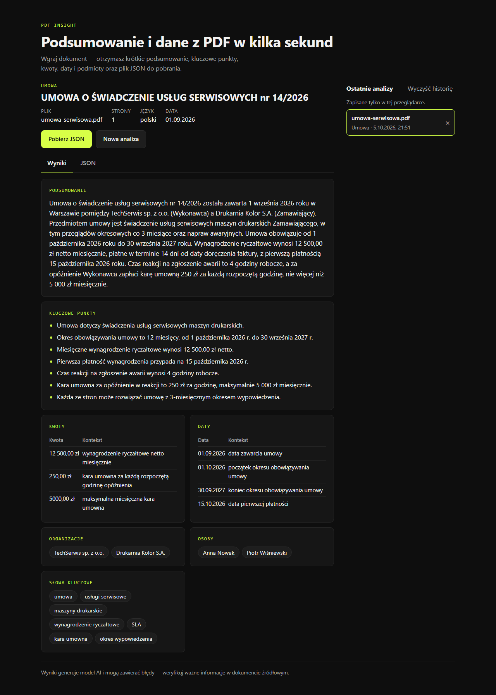
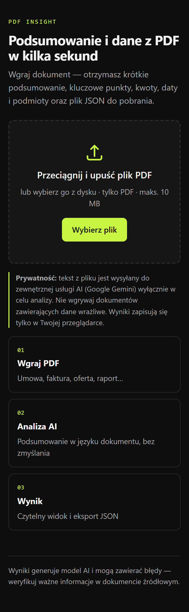

# PDF Insight

Aplikacja webowa, która wczytuje plik PDF, tworzy jego krótkie podsumowanie i zamienia treść w
uporządkowane dane JSON.

**Demo:** https://konradciurkiewicz.github.io/pdf-insight/

<p>
  
  
</p>

## Co potrafi

| Wymaganie                      | Realizacja                                                                                                          |
| ------------------------------ | ------------------------------------------------------------------------------------------------------------------- |
| F-01 Wgrywanie PDF (MUST)      | Drag & drop i wybór pliku; tylko PDF (MIME + sygnatura `%PDF-`), maks. 10 MB                                        |
| F-02 Odczyt tekstu (MUST)      | pdf.js w przeglądarce — do API trafia tylko tekst, nie plik                                                         |
| F-03 Podsumowanie (MUST)       | 3–5 zdań w języku dokumentu; prompt zakazuje zgadywania                                                             |
| F-04 Dane strukturalne (MUST)  | Schemat Zod walidowany w Workerze **i** przed wyświetleniem; 1 ponowna próba                                        |
| F-05 Widok i eksport (MUST)    | Karty wyników, zakładka z podglądem JSON, pobranie `.json`                                                          |
| F-06 Stany interfejsu (MUST)   | Ładowanie z etapami i czasem, błąd z ponowieniem, stan pusty                                                        |
| F-07 Publiczne demo (MUST)     | GitHub Pages + Cloudflare Worker, deploy z GitHub Actions                                                           |
| F-08 Długie dokumenty (SHOULD) | Podział na fragmenty → analiza równoległa → scalenie ([ADR 0004](docs/decisions/0004-long-documents-map-reduce.md)) |
| F-09 Historia analiz (SHOULD)  | Ostatnie 10 wyników w `localStorage`, walidowane przy odczycie                                                      |
| F-10 OCR (COULD)               | Nie — skany są wykrywane i użytkownik dostaje jasny komunikat                                                       |

Zmierzone czasy (od wgrania pliku do wyniku): umowa 2 strony **~5 s**, raport ~300 tys. znaków
(3 fragmenty + scalenie) **~11–13 s**.

## Architektura

```
React SPA (GitHub Pages) ──POST {fileName, pages, text}──▶ Cloudflare Worker ──▶ Gemini API
  pdf.js, Zod, historia                                    CORS, rate limit,       structured output
                                                           Zod, retry, fallback
```

- **`shared/`** — schemat Zod wyniku: jedno źródło typów TS, walidacji (front + worker) i JSON
  Schema przekazywanego do Gemini ([ADR 0003](docs/decisions/0003-shared-zod-schema.md)).
- **`worker/`** — proxy trzymające klucz API; łańcuch modeli Gemini na wypadek przeciążenia
  ([ADR 0005](docs/decisions/0005-model-fallback-chain.md)).
- **`web/`** — React 19 + Vite + TypeScript `strict`; `src/components`, `src/lib`, `src/api`.

Szczegóły: [docs/architecture.md](docs/architecture.md) · decyzje: [docs/decisions/](docs/decisions/) ·
bezpieczeństwo: [docs/security.md](docs/security.md).

### Najważniejsze decyzje

1. **Tekst wyciągany w przeglądarce** — mniejsze żądania, szybsza odpowiedź, plik nie opuszcza
   komputera; skany wykrywane bez zużywania limitu AI ([ADR 0001](docs/decisions/0001-text-extraction-in-browser.md)).
2. **`fileName` i `pages` ustawia serwer, nie model** — tych pól model nie może „zmyślić”.
3. **Fakty z długich dokumentów scalane w kodzie**, nie przez model — żadna kwota ani data nie
   ginie przy łączeniu fragmentów.
4. **Łańcuch modeli** — darmowy plan Gemini regularnie zwraca 503; przy przeciążeniu worker
   przechodzi na kolejny model.

## Uruchomienie lokalne

Wymagania: Node.js 22+, klucz Gemini ([aistudio.google.com/apikey](https://aistudio.google.com/apikey), darmowy).

```bash
npm install
cp worker/.env.example worker/.env      # uzupełnij GEMINI_API_KEY
cp web/.env.example web/.env.local      # VITE_API_URL=http://localhost:8787

npm run dev:worker                      # http://localhost:8787
npm run dev                             # http://localhost:5173/pdf-insight/
```

### Zmienne środowiskowe

| Zmienna           | Gdzie                                                     | Sekret  | Opis                                   |
| ----------------- | --------------------------------------------------------- | ------- | -------------------------------------- |
| `GEMINI_API_KEY`  | `worker/.env` lokalnie, `wrangler secret put` w produkcji | **tak** | Klucz Google AI Studio                 |
| `ALLOWED_ORIGINS` | `worker/wrangler.jsonc` / `worker/.env`                   | nie     | Dozwolone originy (CORS), po przecinku |
| `GEMINI_MODELS`   | `worker/wrangler.jsonc`                                   | nie     | Modele w kolejności preferencji        |
| `VITE_API_URL`    | `web/.env.local`, zmienna repo w GitHub Actions           | nie     | Adres Workera (trafia do bundla)       |

### Skrypty

```bash
npm run check       # lint + prettier + typecheck + testy (to samo co CI)
npm test            # Vitest: schemat, worker (retry, fallback, chunking, CORS, prompt injection), lib frontu
npm run build       # build frontu do web/dist
```

## Deploy

- **Frontend** — [`pipeline.yml`](.github/workflows/pipeline.yml): lint › build › deploy na GitHub
  Pages przy każdym pushu do `main`; w PR tylko lint, testy, skan sekretów (gitleaks) i build.
- **Worker** — [`deploy-worker.yml`](.github/workflows/deploy-worker.yml): `wrangler deploy` przy
  zmianach w `worker/` lub `shared/` (sekrety repo: `CLOUDFLARE_API_TOKEN`, `CLOUDFLARE_ACCOUNT_ID`).
  Klucz Gemini ustawiany jednorazowo w Cloudflare — nigdy nie przechodzi przez GitHub.

## Bezpieczeństwo (skrót)

Klucz tylko w sekretach Workera · gitleaks na całej historii w CI · CORS ograniczony do domeny
demo, obce originy odrzucane przed wywołaniem AI · rate limit 5/min na IP i 30/min globalnie ·
limity rozmiaru pliku i tekstu · treść PDF w ogranicznikach jako dane, nie instrukcje (sprawdzone
na żywym modelu próbą wstrzyknięcia) · brak `dangerouslySetInnerHTML` (wymuszone ESLintem) ·
informacja w UI, że tekst trafia do Google Gemini. Pełny model zagrożeń: [docs/security.md](docs/security.md).

## Znane ograniczenia

- Brak OCR — PDF-y bez warstwy tekstowej są odrzucane z komunikatem.
- Tabele z PDF trafiają do modelu jako tekst bez struktury.
- Darmowy plan Gemini: przy dużym obciążeniu odpowiedź może się wydłużyć lub (gdy wszystkie modele
  są przeciążone) skończyć komunikatem z opcją ponowienia. Darmowy plan może też wykorzystywać
  dane wejściowe do ulepszania modeli — stąd ostrzeżenie w UI.
- Liczba zdań podsumowania wymuszana promptem, nie schematem.

Pełna lista: [docs/known-issues.md](docs/known-issues.md).

## Praca z AI

Projekt powstał z Claude Code. Pamięć projektu i instrukcje dla agentów: [CLAUDE.md](CLAUDE.md),
[docs/](docs/), [.claude/agents/](.claude/agents/). Przebieg, kluczowe prompty i pomyłki AI:
[AI_LOG.md](AI_LOG.md).
